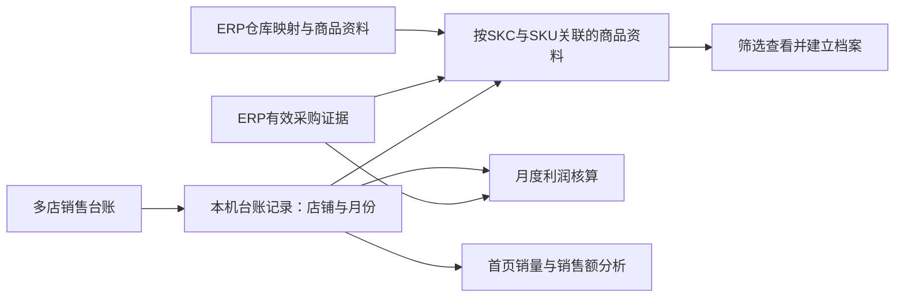

# 0.3.6 升级设计：本机资料归集与选品建档

日期：2026-09-30。建议版本为0.3.6，基于已核对的0.3.5代码 `873a24fc938d69c157b35e5696426781bf72185f`。实施前再确认版本占用；本文件不修改版本号或创建标签。

状态：用户已于2026-09-30明确“然后进行下次更新吧”，本完整方案进入实施。此前仅设计/演示的限制由本次实施授权取代；仍须全部验证通过再按长期授权公开发布，本机安装和真实业务库批量改写不在本次范围内。启动时远端main为0.3.5最终基线 `873a24fc938d69c157b35e5696426781bf72185f`，v0.3.6尚未占用。决策来源为[本批需求及历次澄清](NEXT_BATCH_2026_09_30_IMPORT_SELECTION_ANALYTICS.md)，同秒多价以用户最后“看那个卖的多用那个吧”为准，取代其紧前的平均方案。下文关于模拟演示已通过的记录仍不代表软件功能验收。

## 1. 本版目标与范围

多店台账完整导入本机，ERP补齐对应商品与采购证据；使用者导入后按需查找，进入建档时已有可用的名称、图片、规格、售价、成本和销量标签。

复用现有本地数据库、台账、选品与首页入口。不增加独立“数据库”菜单；联网共用、账号体系改造、个人收藏/任务清单另行规划。正常导入的数据继续保存在用户本机，重启后可继续使用。真实测试台账及其业务明细不进入GitHub、CI或安装包。

| 页面/模块 | 本版交付行为 | 优先级 |
| --- | --- | --- |
| 台账导入 | 多文件完整导入；去掉商品/货号预筛；普通导入只确认一次 | P0 |
| ERP成本采集 | 台账目标自动分批读齐，不因正常数据超过10页/500单要求手动拆分；未完成不判缺成本 | P0 |
| 销量与标签 | 查清七天不可算的链路；按商品来源店铺的完整月份正确计算并展示 | P0 |
| 本机商品资料与建档 | 同SKC未售SKU可补齐；自动带入最新正常售价与来源；保留人工值 | P0 |
| 引流规格 | 明确标记自动排除、可恢复、不改财务记录 | P1 |
| 首页分析 | 月度柱状图柔和配色与自适应布局；标明台账数据口径；点击圆盘店铺展示全部商品、每页5条 | P1 |

P0/P1表示实施顺序，本批全部验收完成后统一交付，不按每个中间修复单独发版。

## 2. 数据如何流转

- 工作区内平台SKU仍全局唯一，SKC为父级。商品资料复用同一身份，台账金额、数量、来源店铺和月份分别保存。
- 仓库档案负责身份/资料映射，采购管理负责成本。采购数量与单价已按库存件数归一，不再根据规格比例二次乘除。
- 同SKC正常未售SKU可进入资料库并取得有证据的采购参考成本；不虚构销量、售价或月度正式成本行。共仓其他SKC不并入。
- 月度正式成本继续保护人工更正及已定稿数据，1688报价只作参考。展示筛选、引流排除、建档售价均不改动原始收入或已定稿利润。

## 3. 台账导入：正常流程一次确认

沿用现有导入页，流程为“选择多个文件 → 自动解析并校验 → 同页概览 → 导入”。月份、店铺、有效行数与异常会在同页展示；用户不再先逐货号勾选。

| 同页区域 | 内容与动作 |
| --- | --- |
| 文件列表 | 文件、店铺、识别月份、读取进度、校验结果；仅错误项展开处理 |
| 批次概览 | 本批新增/重复/替换范围，原始行数与业务排除行数分别统计 |
| 主按钮 | 正常路径“导入”；解析和校验自动执行，不再要求先点校验再点预览再确认 |
| 高级选项 | 列映射、来源范围与重导方式折叠；去掉导入前商品/供方货号筛选 |

具体规则：

1. 台账工作表按名称与必要表头识别，只有一个有效明细页时自动使用；人员汇总页、空异常页不重复读取为明细。若出现多个候选明细页，仅该文件要求选择，不猜测合并。
2. 无店铺列时以文件名建议店铺，允许同页修正；不从供方货号中的数字、人员页名或ERP销售人员推断店铺所有权。各文件仍保持各自来源。
3. 本版沿用一批对应一个核算月份。各店同月可一起导入；若文件跨月，在同页指出具体文件并按月处理，不把不同月份揉进一个月，也不追加自动拆账规则。
4. “完整导入”指所有目标店铺和商品，正常销售类型、盘亏等既有业务分类不变。被业务规则排除的记录须有明确统计，不能静默遗漏商品。
5. 重复导入按现有内容与范围规则跳过；发生替换时，同页明确影响范围并沿用既有覆盖校验。取消商品预筛不等于默认覆盖整个店铺月份；已定稿/锁定账本保护继续有效。
6. 文件错误只标在对应项，可修正或明确移除该文件后导入剩余文件；不静默跳过错误行后宣称整批完整。提交仍原子化，失败不留下半批生效数据。
7. 大文件在Worker内处理，分批传递/写入，避免反复复制整份明细和一次渲染全部行。显示阶段及真实已完成量，未知总量时不编造百分比。取消解析可终止并重建Worker；写入失败或取消须回滚，最终结果可复核。

## 4. 本机资料展示与建档

保持现有“选品商品库 / 成本与利润参考 / 待确认采集”入口。资料参考页承担全量商品查询，商品库承担已保存档案，不另建一份重叠的商品数据库。

查询区统一为：店铺、供方货号、商品搜索（名称/SKC/SKU/仓库SKU）、销量标签、建档情况，以及“清空筛选”。默认显示当前来源范围全部商品；筛选顺序为全范围搜索/筛选、排序、分页。显示“匹配数/总数”，不得只搜索当前页。

查询条件只影响展示。正式利润、正式报告的月份和店铺范围继续沿用现有核算选择，不因搜索框输入而改变；若以后需要按人员生成独立账本，需另外设计。

建档页布局沿用现有紧凑结构：

- 顶部：名称、图片、SKC、店铺、状态及自动销量标签。核算来源新档默认“已上架”，缺项可保存并保持该状态。
- SKU表：属性、平台SKU、参考成本、当前售价、参考利润；一规格一行，字段对齐，详情与恢复采用紧凑操作。
- 来源区：供应商、1688链接及必要来源说明；同供应商/同来源不重复建卡。图片优先本次关联台账净销量最高的正常规格，有缺图时按已有同SKC稳定回退规则选取。
- 引流排除放在SKU表后的折叠区“已排除规格（N）”，可恢复。详情默认收起；缺项提示就在对应字段，不新增满页警告或反复弹窗。
- 底部保留保存入口；已有人工标题、图片、售价及主动清空都受到保护，后台资料晚到不能覆盖正在编辑的内容。

无销量分支不显示“缺少成本”作为默认推断。未查采购、采购未读齐、读齐后确实无有效采购，应使用不同状态；名称/SKC/SKU关系满足建档要求时，可保留待补资料保存。

## 5. 售价预填的确定规则

适用对象为当前商品SKU、当前关联店铺与台账月份中的有效正常销售。用户确认普通情况取最新一笔正常销售单价。促销成交仍属于有效销售；不因有活动信息就自动排除。退货、扣款、盘亏不能成为“最新正常销售价”的候选。

1. 以业务添加时间的完整时间戳比较，使用北京时间语义，支持源格式含时分秒及Excel日期小数部分。不能仅比较现有按日字段，也不能使用导入先后或文件行序代替时间。
2. 最新时刻只有一种有效售价时采用该价。真实零价与空值区分；没有可用售价则留空，不复制其他规格价格。
3. 最新同一时刻有不同售价时，执行用户最后确认的“卖得多用那个”。设计采用的统计范围为本次关联店铺、本台账月、该SKU，按各候选价的净销售件数比较；排除非销售记录，合法冲销按原价扣回。比较的是件数，不是订单行数或销售额。
4. 只有最新时刻出现的价格参与上述比较，历史畅销旧价不能取代唯一的最新价。各候选价净销量仍并列或无法确认时标注“售价待选择”，保留来源并允许先保存档案；不擅自取均价、最高或最低价。
5. 字段简短显示“台账 · 日期”，详情可查关联店铺、批次和源行；用户修改后按人工值保留。再次导入只刷新仍由系统维护的参考值，不覆盖人工值、主动清空或未保存编辑。
6. 这套规则只预填选品售价与参考利润。正式利润仍逐笔使用原始台账金额，不将选定售价乘回整月数量。

销量更多为用户已确认规则；同店同月统计范围、并列时可保存待选是本设计给出的具体处理方式，未声称用户另行确认了每个技术细节。

## 6. 七天销量、标签与旧数据兼容

计算周期保持“来源店铺最新完整历史台账月份的最后七天”，按自然日含首尾。例如一个31天月份取25日至31日，不标成今天往前七天。每个商品显示实际日期范围；单店可计算时不被其他店缺月阻断。

| 七天净销量 | 自动标签 |
| --- | --- |
| ≥700件 | 爆款 |
| 100—699件 | 高销 |
| 10—99件 | 一般 |
| 0—9件 | 低销 |

- 台账完整、商品归属明确且窗口内无销售时可计0；缺日期、缺来源、身份冲突、净量异常不能伪装成0。合法销售冲销按净量计算。
- 自动标签独立于手工标签，但商品库、参考页、建档页和标签筛选必须使用同一结果。更新台账后自动刷新，不要求人工复制标签或重新开关页面。
- 跨店总览若需汇总，必须使用共同期间；各商品自己的有效标签不因此清空。不将不同店铺的不同月份加成一个“七天”。
- 从导入完整范围、批次有效记录、日期与店铺关联、派生计算到UI逐层追查现场异常。现有可能原因是旧批次缺完整范围声明、分组重导残留、全局店铺范围阻断；这些不是已证实的唯一现场根因。
- 对旧来源只补可证实的元数据。能依据已有完整批次重建的结果优先派生；证据不足时，提供一次来源确认入口，不逐商品确认，也不无依据把旧批次全部标完整。实际真实库修复另按备份、影响和回退授权执行。
- 真不可算时仅显示一个主要原因及对应入口，如“台账范围待确认”“日期待补”；正常商品不展示技术字段。

## 7. ERP采集：目标读齐与可恢复进度

采集目标来自已导入台账的完整SKC/SKU范围，并通过同SKC映射补正常未售分支。页面当前搜索或显示数量不改变采集目标，不将全量台账解释为ERP全公司采购扫描。

1. 将目标按店铺与必要仓库SKU去重，后台分批分页读取；同批且查询范围、月份截点与证据版本一致时复用完整采购证据，避免为每个SKU重复取同一仓库历史。
2. 移除正常业务中的10页/500单硬失败逻辑，以有效分页结束信号和目标完整性判断完成。重复页、分页停滞、超时、登录失效仍明确停止；达到执行预算则记录未完成目标与可用进度，支持重试/续取，不能把截断结果当作成本缺失或正式完整结果。
3. 进度显示“当前阶段 + 已完成目标/目标总数”，必要时补当前页。成本读取与商品资料补取分别标记；已有完整成本不等待可选图片补取才回传。
4. 取消/作废采购不参与有效成本、不占最近三笔。月份截止、正式成本取样与加权规则、已归一数量/单价继续沿用已确认口径。
5. 未完成目标不得覆盖旧的已有效证据；完整性必须落实到目标证据，不能只设置一个“整批成功”。若现有收件契约不支持安全部分采用，先保留可恢复结果，不能绕过契约直接写正式成本。
6. 保留requestId、evidenceRef等稳定关联，回传重试幂等，旧版本兼容明确。新增进度或完整性字段先改契约和测试，再改扩展与接收端。扩展版本实施时随实际修改统一递增并与桌面候选一同验收。

## 8. 首页和圆盘明细

首页仍以台账销售趋势为主：默认按日显示销售额，可切销量与月度。图旁简短标明“台账 · 月份/店铺”，不混称利润或ERP采购数据。

月度柱状图追加设计（用户2026-09-30指出现有颜色不好看）：

- 推荐柔和分色：蓝、青绿、灰紫、暖褐、灰青，降低现有统一68%饱和度带来的刺眼感；浅深色分别配置清晰颜色。不是把所有柱子变浅到难以辨识。最终颜色需在实际页面验收。
- 同一店铺在每日、月度、图例和圆盘中保持一致，切月份、指标或筛选时不能换色。继续以店铺身份绑定颜色，不按当前排序序号临时着色；店铺较多时配合文字/交互辨识，避免只凭颜色。
- 店铺对比模式下，单月时让柱子在可用宽度内均匀分布，柱宽设合理上限，以间距分配剩余空间；不把唯一柱组限制在左侧180px。直接显示店铺名称，月份放在图旁；多月时仍按月份分组并保持店铺顺序一致，不改成堆叠图。
- 增加少量浅色网格、易读刻度与金额/件数单位；单月空间足够时显示柱上数值，多月或窄窗口拥挤时保留悬停、聚焦及点击详情。已知0、未知、负值保持原有含义，不把小额柱人为拉高、不用截断纵轴制造差异。
- 保留原有期间和店铺范围及数据口径；点击与返回按下述浏览逻辑统一，初始配色预览的高亮本身不定义新数据契约。小幅顶端圆角，不增加渐变、阴影或三维效果。
- 决策对话提供纯合成数据预览：推荐“柔和分色”竖柱；“单色排列”横条仅作外观对比，不自动纳入默认页面，不改统计规则或预置测试数据。本轮仅设计，未修改正式程序。

实际规模及简化交互（用户随后明确“最多10个店，最大12个月的数据”）：

- 本版围绕10家店、12个月的主要使用规模设计和验收，撤回前述为30/100店、36个月准备的复杂控件建议。这是界面与验收目标，不新增强制导入上限或自动清除历史数据规则。少量店铺也可能有十万行台账，已有大文件处理要求继续保留。
- 月度视图区分“月度总览”与“店铺对比”。总览每月一根柱，清楚表示全部店铺合计；对比使用柔和店铺色。默认12个月，提供近3/6/12个月选择；已有明确期间选择优先保留，不因新导入自动重置。未导入月份显示缺数据，不补成0。
- 对比店铺直接列出最多10个勾选项，即选即生效，可全选或清空，不增加店铺搜索器、店铺分组翻页或另一步确认。演示初选3家仅为展示，不作为正式软件默认截取Top3的规则；全部10家可同时纳入比较和统计。10种店铺色保持身份稳定，并始终配店名。
- 总览在正常桌面宽度优先呈现完整12个月；窄窗口或多店对比过密时，月份按可读宽度分段，通过“较早月份/较新月份”查看同一范围。清楚区分图中可见月份与已选3/6/12个月范围，不随分段改变期间合计，不把柱子无限压细。
- 点击月份显示该月完整店铺明细，再点店铺显示商品；搜索和排序作用于当前完整范围，明细每页5条，合计不随翻页改变。此演示的新增点击路径是待实现的设计，不代表正式软件已具备。
- 绘图只消费月/店铺汇总，业务明细按需读取，大文件处理继续放后台；来源更新后刷新汇总，避免悬停或切颜色反复全量扫描。实际性能仍需应用端隔离验收，不用演示响应速度替代真实台账压测。

决策对话已提供独立模拟演示（10店×12月，每店每月17个合成商品）。演示自身的月份范围/分段、完整搜索、5条分页、全选与空选、汇总一致、店铺与商品返回，以及800/360/320宽度下的浅深色检查通过。未加载用户业务数据，未修改或验证正式应用的对应新功能。

浏览逻辑优化（用户补充“符合正常使用习惯”）：

- 在首页分析区域采用“趋势总览 → 所选月份的店铺列表 → 店铺商品明细”。每次显示当前层内容，避免图表和多层明细持续堆成长页；保留上级路径和命名明确的“返回趋势/返回店铺”。不增加顶层业务菜单。首页既有每日/月度选择仍按原范围处理，本演示专注月度。
- 点击月份一次进入当月各店，点击店铺一次进入商品；悬停只提供说明，不能自动改变筛选或跳转。不再添加进入前确认。只有月份放不下时显示较早/较新月份控件，完整放下时隐藏不可用的分页操作。
- 返回上级保留期间、图表模式、店铺选择、搜索词、排序、页码，并恢复原入口焦点；正式页面还需恢复对应滚动位置。月份和店铺不同的列表各自记忆当前上下文，不把一个店的商品搜索词直接套给另一店。新上下文默认第一页，返回已有上下文恢复原位置；来源变化导致页码越界时只调整到最近有效页。
- 明细页提供上月/下月及月份选择，范围仍限于当前选择的期间。在商品层切月份时继续看同一家店，不必先退回总览再进入；路径、数据和合计必须一起更新。边界月份相邻按钮禁用，不自动扩大期间。
- “销售额/销量”只切图表指标，不能顺便重置明细搜索、排序、选中月份或页码。店铺勾选即时生效；保留选中状态，不因切到总览再返回对比而丢失。默认或首次选择不能静默按TopN取店铺。
- 搜索覆盖当前完整范围，搜索/排序变化时回第一页；清除搜索回到当前范围全量。空结果保持上级路径和清除入口。期间合计、当月所选店铺合计、单店当月合计分别标明；搜索和分页不把这些完整范围合计改成当前五行小计。
- 实际应用通过已有路由/状态管理衔接返回，不误接管ERP页面或桌面宿主导航；异步切月/切店时保持布局和简短加载反馈，只接受当前请求结果。失败时原筛选可恢复，缺数据与0明确区分。这里是实施要求，模拟演示未替代真实路由、滚动与异步验收。

演示已更新为上述分层浏览，验证键盘进入月份/店铺、路径返回、父列表第2页及搜索/排序/焦点恢复、直接切月、清除空结果、切指标保持上下文，并检查三层在800/360/320浅深色布局下无横向溢出。导航细则以演示问题和通用桌面交互原则设计；本地UI指南检索未获得精确匹配此场景的桌面导航样板，未将通用建议标为已验证的软件实现。

圆盘选择店铺后：

- 标题改为“该店商品明细”，展示当前日/月范围的全部商品，取消Top5截断及Top5占比文案。
- 商品列表每页5条，支持销量/销售额排序；先全范围搜索再分页。切店铺、日期、排序或搜索时合理重置页码；清空搜索与“全部店铺”恢复对应范围。
- 店铺合计与期间合计不随单页变化，搜索结果另用条数说明。缺SKC记录保持可见并提示待补，不因身份不完整消失。
- 圆盘本身不强制每页5家店，仍表示当前期间店铺构成；负值或不可用合计按现有规则展示列表说明，不能制造扇形比例。
- 中文、浅深色、窄窗口及键盘操作沿用现有组件，返回时保持合理焦点与滚动位置。左上角小灯继续保持既定简洁方式，不恢复冗长扩展状态面板。

## 9. 实施边界与依赖

| 顺序 | 主要代码边界 | 交付内容 |
| --- | --- | --- |
| A 契约与来源 | salesImport、salesAnalytics、selectionSalesLabels、ERP domain contracts | 完整时间与售价来源、范围/完整性语义、排除和恢复状态；先定义兼容测试 |
| B 导入与本机查询 | ImportPreview、import.worker、batchSalesImport、profitRepository | 自动校验与单次确认、完整目标、重导保护、大文件处理及来源元数据 |
| C ERP采集 | 扩展content/catalog、ERP inbox与catalog repositories | 目标分批、去重、读齐、取消/重试、完整证据回传；与B共享目标契约 |
| D 建档与标签 | erpProductCatalog、selectionRepository、ProductEditor、SelectionSalesTag、相关参考页 | 售价预填、未售分支、自动标签统一、引流排除/恢复与人工值保护 |
| E 首页 | salesChartModel、SalesMonthChart、SalesAnalytics、SalesPeriodDetails及模块样式 | 稳定柔和配色、单月布局和刻度、全店商品、每页5条、搜索排序和统计口径说明 |
| F 集成验收 | 前端、桌面、扩展、候选与发布检查 | 真实路径与合成回归、升级保留数据、包内无测试数据，然后统一交付 |

clientDatabase仅承载必须的追加迁移；优先复用已有来源和派生结果，不为查询再存一份整月业务副本。新增持久字段按模块契约管理，旧迁移不改写；业务逻辑不堆回database façade。样式写入页面模块文件，保留入口顺序。

本版沿用用户要求的一个版本一个执行对话。实施已授权，使用独立Worktree及codex/分支，由执行端完成实现、自检、集成和发布，主对话接收结果或必要业务决策；不在旧0.3.5执行对话追加本版开发，不改动决策工作区和主目录既有未提交内容。

## 10. 验收矩阵与交付条件

| 场景 | 通过信号 |
| --- | --- |
| 多店同月、多文件、十万行级单文件 | 来源行数可对账，店铺/月不混；汇总页不重复；界面持续反馈并可取消 |
| 重复文件、同店同月重导、来源改变 | 不重复核算；替换范围明确；预览失效需重算；失败无半批生效 |
| 完整/部分月份与旧批次 | 完整范围不因商品搜索缩小；缺来源给具体原因，其他店可用结果不消失 |
| 七天边界与销售冲销 | 0/9/10/99/100/699/700及月末边界准确；负冲销按净量；未知不当0 |
| 售价多值、时间乱序与日期精度 | 唯一最新价正确；保留时分秒；同秒多价按候选价对应件数决定，普通情况不被旧畅销价替代 |
| 售价销量并列、0价、缺价、人工更正 | 并列可待选保存；零与空区分；不覆盖人工及显式清空；不改月度收入 |
| 同SKC未售分支与共仓其他SKC | 无销量正常SKU有正确身份与有证据成本；共仓非目标SKU不认领，不伪造销售 |
| 标题、图片、供应商与补资料 | 本次净销量主图规则、名称清理、供应商去重正常；晚到资料不覆盖人工编辑 |
| 引流规格排除/恢复 | 明确标记才排除，低价/1pc不误排；保存重开及补取不反复加回；恢复后保持；财务合计不变 |
| 超过10页/500单的目标采购 | 自动继续目标分页；重复页/慢响应/取消/重试都有明确结果；未读齐不产出正式完整证据 |
| 采购无效状态与成本范围 | 取消/作废不占三笔；不二次换算比例；不覆盖人工有效值或已定稿结果 |
| 月度柱状图 | 单月不挤左侧；多月/多店不重叠；跨视图店铺颜色稳定；浅深色和窄屏清晰；0/未知/负值/微小值与合计不变，键盘可获取详情 |
| 月度图实际规模 | 1–10店、1–12月及十万行级台账可查完整范围；合计/对比清楚；10店可直接勾选、无店铺分组翻页；月份分段与明细分页不改合计；缺月不补0；颜色稳定、来源变化后汇总刷新；记录真实应用耗时 |
| 浏览与返回 | 月份→店铺→商品路径清楚；返回第2页恢复搜索/排序/页码/焦点及实际滚动；直接切月保留店铺；指标不重置列表；空结果可恢复；快速切换不显示旧请求结果 |
| 圆盘明细 | 第6名及以后可搜索；每页5条；全店返回、排序、空结果、缺SKC和总额均正确 |
| 关闭重开与升级 | 导入数据、已建档、人工修改与排除状态正常保留，不因新安装包空数据要求清掉用户库 |
| 干净安装与交付物 | 无真实测试店铺、预置台账或业务明细；源码、前端资源、asar/extraResources和发布附件均检查 |

先在隔离本机环境使用用户提供的样本做完整用户路径验收，原件只读，不操作正式业务库；涉及真实ERP时沿用只读与既有授权边界。CI使用独立合成数据，覆盖来源格式与边界，不上传真实文件、转换明细、数据库或含业务数据的截图/快照。

发布前执行前端test/build、适用的desktop verify与隐藏桌面smoke、扩展验收及中文/浅深色/窄窗口检查。既有导出表头、两位截断、1688关联单号、代发和扣款规则保持，并针对本批变化验证财务合计不变。当前只有设计文档检查通过，不等于上述功能验收已通过。

本批已获准实施；全部通过后依既定授权连续完成集成、CI、候选验收、稳定版公开发布与公开资产回读。不逐中间提交发版，不代替用户覆盖安装或批改真实数据。

## 11. 决策状态

已明确：本机持久保存、导入后筛选、ERP映射补全未售SKU、最新正常售价、最新同秒多价选销量更多者、历史月末七天四档标签、明确引流标记可恢复、圆盘全店明细每页5条、测试数据不进GitHub/安装包。

暂无阻碍设计完成的必答问题。新增“我的清单”、联网共用、按人员另建财务账本、真实旧数据批量修复不自动纳入本批。版本号与扩展号在实施前核对占用，本轮不预占远端版本。
