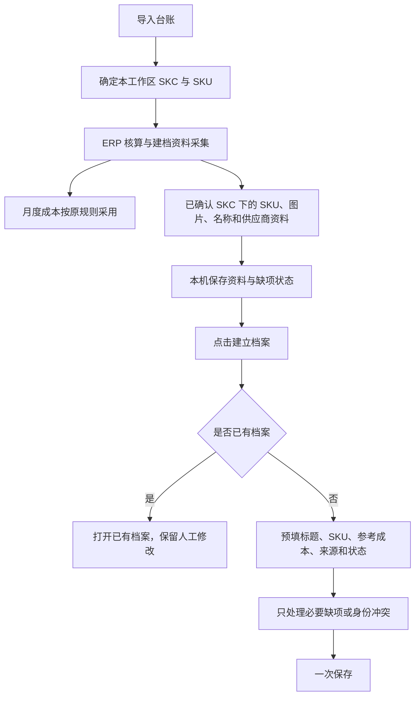

# 选品建档 0.3.3 正式版升级方案

日期：2026-09-29。最新授权：用户先要求推进测试版本，随后明确“直接正式版吧”，现已授权按完整范围实施并交付正式版0.3.3。历史整月台账末七天、爆款/高销/一般/低销四档规则不变。本机不安装、不改真实库；先通过隔离候选验收，再公开稳定版。需求原始记录见 [需求记录](SELECTION_PRODUCT_BETA_PLAN.md)。本文路径沿用规划期文件名，当前交付目标以本段为准。

## 1. 交付目标与范围

目标：一次台账导入及ERP核算，尽量取得可直接建档的完整资料。用户点击建档后看到已填好的商品和SKU，通常只需保存；资料缺失时只处理实际缺项或冲突。

本批包括ERP资料采集、回传与本机保存、未售SKU补全及参考成本、标题预填、销量标签、统一状态、建档表单精简、已有档案兼容和正式候选验收。保持中文、本机Windows桌面交付。

本批不做：ERP侧商品或采购数据写回、自动上架外部平台、无人确认批量建立档案、将其它SKC认领到当前工作区、重新核算已定稿月份、调整报表导出外观、生产数据库批量改写。状态“已上架”是本机档案记录，不执行平台发布。

本批采用正式版 `0.3.3`，不发布中间Beta。2026-09-29已只读核对GitHub稳定Latest仍为0.3.2，main为 `d34e1f75d08ac251c5645eb25fabd74ece1a7789`；开工及发布前再次核对版本占用。先构建隔离候选，再完成审查、测试、CI、实际用户路径验收和稳定发布资产回读；无需再次索取发布确认。所有工作包统一发版，不为中间提交单独发布。

## 2. 已核对的基线与缺口

只读核对0.3.2工作区 `d308` 的实现；开始开发前须重新确认最新集成基线和在制修改。

| 现有能力 | 已见缺口 | 本次处理 |
| --- | --- | --- |
| ERP扩展源清单版本8.0.23，已有采购资料、catalogMappings和v2回传 | 页面字段存在不代表所有路径完整采集；同仓库混有多个SKC | 沿原采集链补齐目录查询、准确过滤、覆盖状态及缺项重试 |
| ERP目录能按SKC展开同组SKU | 辅助目录投影有意不产生价格/数量/正式成本 | 增加有证据的选品参考成本关联，不能将未售SKU伪装成月度销售行 |
| selectionRepository从已发布且请求/工作区/月账本匹配的批次读取目录 | 目录生命周期与核算批次绑定；不能直接删掉验证来绕开 | 保留已验证入口，设计独立资料完成状态及安全补取 |
| 名称仅在ERP来源名称完全一致时预填 | 多颜色名称与引流配件可导致父级名称为空 | 增加保守的主体名称提取和候选选择 |
| 现有发布状态、选品状态分别保存，支持自定义选品状态 | 两套状态重复；在售校验要求售价、属性、来源、成本 | 统一一个用户状态，资料完整度单列，保留旧值与自定义状态 |
| 英文标题、供应商编号、1688采购价等触发资料警告 | 对核算来源建档形成重复填写和噪声 | 移除无用输入、警告与相关完整度扣分 |
| 新ERP规格purchasePackCount默认1，表单求和 | 4个SKU显示4份，容易误解为实际采购量 | 建议移除总份数展示，保留必要的真实规格换算 |

以上是源码与页面样本核对，不代表现有用户数据库已完成逐条诊断，也不代表整条新流程已通过测试。

## 3. 用户流程

核算和月度定稿都不是建档的资格前提。已缓存的目录、已确认的商品身份同样可进入建档，无销量SKU可作为同SKC的属性分支。新资料按后台回传到达后更新候选可用性，避免要求用户手动来回检查；沿用简洁扩展指示灯，不恢复冗长状态面板。

资料齐全时：点击“建立档案”→预填页→保存，不另设供应商确认、成本审批、发布确认等多层流程。保存后返回原列表和筛选位置，显示“查看档案”。有未保存修改时保留现有离开保护，避免误丢资料。

## 4. 身份与来源规则

1. 用台账或已有明确档案确认本工作区的SKC范围，按平台SKU的现有规范化规则匹配和去重，保留原始标识展示。
2. 直接按已确认SKC查询ERP商品档案，枚举查询结果所有页、关联仓库SKU及映射明细。结果不能只取第一条，也不能按仓库编码前缀判断归属。
3. 只保留明细中准确属于目标SKC的SKU，包括台账未出现的SKU。同仓库其它SKC不纳入；销售人员完全不参与归属筛选，店铺只保留来源。
4. 一个SKU出现多个互斥SKC或不一致仓库映射时，保存冲突来源，不静默改绑。冲突SKU不阻止其它明确SKU继续获得资料。
5. 本工作区SKU全局唯一：已归档SKU不能重复建立。SKC命中多个旧档案时显示对应档案，不自动合并。
6. 同一SKC多个仓库SKU各自保留成本和资料；同仓库SKU被多个平台SKU复用，仍保留各自属性及换算，不能直接复制一个价格给整组。
7. 全新且未确认归属的整个SKC不从共享仓库或销售人员推断。首次纯手工/1688建档沿现有入口及默认规则保留，本批不扩大自动认领范围。

## 5. 采集与回传契约

先更新契约和验证，再实现采集与页面，复用现有envelope、inbox和本机数据库，不增加云端依赖。以下为拟新增或补全的语义，最终字段名在契约实现时统一：

| 数据组 | 内容 | 来源与边界 |
| --- | --- | --- |
| 请求与范围 | workspaceId、requestId、batchId、ledgerId、目标SKC集合、采集时间、协议能力 | 必须与本机发出的请求匹配，不能相信回传自行扩大范围 |
| 目录身份 | 平台SKU、SKC、仓库SKU、原始名称、平台属性、仓库规格、店铺来源 | 平台属性与采购规格分开，不能拿采购描述冒充平台属性 |
| 商品资料 | 主体/SKU图片、供应商名称、1688商品链接、来源采购行 | 图片和链接应保持与具体商品、供应商配对，不交叉拼接 |
| 成本证据 | evidenceRef、仓库SKU、采购记录及既有选择规则、单位换算、时间口径 | 可复用既有完整证据；缺少稳定关联不能升级正式成本 |
| 采集覆盖 | 目录/映射/图片/供应商/成本证据各自complete、partial或unavailable及原因 | 核算完成不等于资料全部齐全，合法空值区别于尚未抓取 |
| 补取关联 | 原请求、目标SKC、缺项范围、资料版本及幂等标识 | 只补资料不重新触发正式成本采用或修改已定稿结果 |

采集顺序：复用已有核算查询及本机缓存→仅对缺少或待刷新的资料查询商品档案/采购详情→校验SKC/SKU关联→回传本机。查询按SKC和仓库SKU去重、分页完整，使用有限并发和有限重试；登录失效或限流时暂停相应读取并显示一条可操作提示，不能静默使用过期结果冒充本次完成。

第一次有效回传持久化后才显示已收到；重复回传、重启恢复、跨月份相同SKU均应幂等。原始批次证据不可被后来的资料覆盖；最新展示投影单独维护。已经通过校验的成本结果不因可选图片/链接抓取失败而丢失。

旧扩展缺少新增能力时仍可按旧协议核算；界面只说明建档资料未齐并允许使用已有资料，不能因为字段不存在就全批拒收。未经验证的旧数据不得直接迁移为可信新证据。补取入口须能沿已绑定请求校验范围，不能绕过当前published/request校验。

### 5.1 资料生命周期与独立补取

目录辅助资料与采购成本证据分开存放。目录只包含身份和图片、名称等元数据；未售SKU的参考成本从已验证采购证据与明确单位换算派生，不能往现有无价格目录字段中塞入未经审核单价。投影保留来源版本和采用理由，月度正式采用仍只走原利润入口。

资料补取采用单独的请求能力及处理分支：本机生成并保存目标SKC范围、工作区、原有效请求/目录来源和幂等键，再接收范围内的返回。允许已有确认身份的产品发起仅资料请求，不能要求其必须先有销售或完成定稿。该分支不调用正式成本采用、月度定稿或旧参考审批升级逻辑；不能通过删除当前成本批次published/request检查实现。

回传状态区分“等待资料、部分可用、资料已收齐、需要重试”，按字段组记录，不增加审批阶段。网络重试只补失败分组；成功持久化后才确认收到。可选图片或供应商查询失败不回滚已有效成本；协议、工作区或身份范围验证失败的部分不得进入可信资料。关闭重开、重复回传和两个窗口同时保存时，采用事务及唯一约束保证不会重复创建或半份覆盖。

## 6. 成本与销售口径

| 场景 | 目标行为 |
| --- | --- |
| 已售SKU已有有效ERP成本 | 直接复用，显示金额、来源及适用月份；无需再填1688采购价 |
| 有效人工更正 | 保留原工作区/月/店铺/SKU范围和优先级，不因补资料或建档覆盖，不提升为全局永久成本 |
| 同SKC未售SKU有完整仓库采购证据与换算 | 可形成选品参考成本，显示ERP参考来源；不新增销量或月度正式成本行 |
| 只有ERP商品档案单价 | 不等同于正式采购成本；本版默认不将它冒充已采用ERP成本 |
| 缺采购证据或换算不明确 | 显示对应缺项，不能统一标成缺销售台账，也不以0代替缺失 |
| 无台账历史 | 显示暂无销售记录；不伪造销量、收入、实际利润或热销标签 |
| 真实零值/微小正数成本 | 沿既有业务策略接受有效值，避免通过Boolean或大于0校验误判缺失 |

沿当前请求的采购时间口径进行核算及参考证据选择；历史月份的数据不宣称是当前最新采购价。不得为取得资料绕过截止日期、排除规则或evidenceRef要求。参考利润与实际利润分开；未填写当前售价时可展示真实历史销量/成交数据，不用历史均价自动覆盖售价。

## 7. 标题、图片与标签

标题采用可解释的本机规则：已有人工标题优先；对目标SKC内仓库名称保留原文，再移除明确的人员/店铺后缀与独立数量/颜色前缀。保留构成商品含义的关键数量、型号和组合描述，不能通用删除全部数字或颜色词。

按清洗后的主体候选归组。主体候选一致时直接预填；出现配件、引流SKU或多个不同主体时，不凭低价或销量高低硬判。默认展示建议名称和可展开的来源候选，允许一次选取/修改；具体判定样例在实施前用当前截图及脱敏样本形成测试集。未可靠选出标题时只提示名称，不附带英文标题等无关警告。

SKU图片保持各自来源。封面优先采用已有封面或明确主体SKU图片；主体不明时允许选择，不能让引流配件图片无提示替代主图。ERP或远端图片不可用时显示占位且允许后补；若仅保存URL，应明确离线显示取决于已有缓存，不承诺未实现的永久离线图片。

用户最新要求将“高销、热卖”合并为“高销”，将“一般、较低”合并为“一般”，保留爆款与低销。合并后按四档执行，覆盖此前月度三档及七天六档方案；阈值由高到低且包含下界：

| 台账月末7天销量Q（件，按SKC汇总） | 标签 |
| --- | --- |
| Q≥700 | 爆款 |
| 100≤Q＜700 | 高销 |
| 10≤Q＜100 | 一般 |
| 0≤Q＜10 | 低销（需有效完整统计依据） |

用户进一步确认输入为“整月完整台账，不是最新的”。本版默认以最新有效完整台账月份的月末为截止日，含截止日向前统计7个Asia/Shanghai自然日，即该月最后七天。例如最新完整台账为2026年8月，窗口为8月25—31日；即使最后一条销售行在8月29日，完整月覆盖仍截止8月31日；9月导入该文件也不能把截止日设为9月。界面称“台账末7天销量”，显示实际区间，不能称当前或实时热销。底层按日期区间聚合，可处理跨月/跨年，但本版默认月末窗口不需要额外补导前月。

源码核对：`salesImport.js` 从台账“添加时间”解析为sourceAddedDate，`salesAnalytics.js`已有每日销量聚合，非导入时间或ERP采购日期。该字段当前代表台账添加时间，不声称已验证为平台下单时间；本方案沿台账现有日统计口径，实际样本须在验收时核对日期含义及覆盖。若用户需要平台下单口径而源文件不支持，应另确定数据源，不偷偷替换日期。

使用真实已导入且有效的销售行，排除被替换、撤销及重复批次，以及扣款/盘亏等非销售记录；按SKC汇总各SKU。负数量沿已确认台账销售口径处理，不擅自取绝对值；最终净量为负的异常结果不套入0–9低销档。手工标签单独保留，自动更新只更新自动标签；同一来源重复导入不能重复累计。多店铺聚合在同一日期窗口内统计，标明范围，不能把不同店铺各自的最新七天拼接。

完整度须依据整月导入范围、日期有效性及店铺范围判断，不能仅凭有7个日期或最新销售行推断已完整覆盖。用户确认的正常整月导入记录月初到月末的覆盖信息；这表示源文件范围，不意味着系统仅凭文件内容就能独立证明导出完整。无记录但不能确认覆盖显示“数据不足/暂无销售记录”，不能自动评为低销；完整覆盖且可确认没有销量时允许按0件评为低销。不使用月销量除以天数估算，不将少于7天数据按比例放大，不借ERP采购量替代销量。

标签显示例如“高销 · 台账末7天350件”，旁边简写“8/25—8/31”，展开可见年份和店铺范围。导入/替换/撤销台账后重算；仅日历跨日不移动已确认的历史台账窗口。缺日期时不生成无依据档位；历史标签必须明确截止日期。首版阈值集中定义并校验档位完整且不重叠，不额外开发复杂规则设置页；后续调整仅影响自动标签，不改变销量、利润或手工标签。筛选项、图例与自动标签统一采用四档，不再生成热卖或较低；同名手工标签不擅自改写。

### 7.1 销量来源范围（已确认）

用户明确“无法获取，只能通过台账”。本次升级的销量唯一来源为有效导入台账，撤回官方销量接口作为可选接入方向的安排，不开发店铺API授权、实时销量同步或第二销量源，也不再等待相关权限。此前公开文档调查仅为历史讨论，不构成实施范围。

ERP继续提供商品身份、建档资料及采购成本，ERP采购/发货数量不替代台账销量。导入、替换或撤销台账后自动更新七天标签；没有更新台账时保留其实际统计日期，不宣称实时销量。完整覆盖、缺日期、跨月窗口及去重规则沿本节执行。

### 7.2 历史整月台账的统计执行规则

1. 导入预览沿现有月份、店铺和来源识别，增加紧凑说明“完整月台账：2026-08”，默认采用本次已确认的整月用途，不增加逐文件确认弹窗。发现多月份、月份不符或缺日期时就近提示；若用户以后导入筛选商品或部分日期文件，应能在展开的来源设置中标记不完整，该文件仍可沿现有核算规则导入，但不能据此判定全店零销量。
2. 保存来源覆盖的月份、店铺范围、完整性声明来源与有效批次关系。日期有效率和范围完整性分别记录；现有日统计的“所有行均有日期”不能直接等同于完整月范围。新旧来源必须区分：旧批次若未保存足够范围信息，保留可计算件数但不自动赋予完整覆盖；正常替换原台账后补齐来源记录，无需重做ERP成本采用。
3. 单店默认选该店最新有效完整月，多店汇总选所选店铺均有完整台账的最新共同月份；表头统一显示月份，不能把八月和九月拼成一个标签。没有共同月份时显示“缺少同月台账”，可按店铺分别查看。不自动把用户手动查看的历史月切回最新月。
4. 使用该月份有效销售来源去重后的行，按添加日期落入最后七天汇总。有效完整月中，已确认属于该范围的SKU没有销售行可计0；未明确关联到店铺范围的SKU不据此判零。该规则仅影响标签投影，不向利润台账补写零销量行。
5. 缺失/非法日期的销售行若能定位到SKC，至少该SKC标签显示数据不足；无法定位到商品的销售行使对应店铺窗口的完整性不确定。不得把这些数量全部归到月末或丢弃后仍宣称完整。月度核算能否继续沿其既有规则，不被标签失败阻断。
6. 最新整月台账内某商品数据不足时，不偷偷改用更早的好月份标签。最新完整来源被撤销后，按剩余有效来源重新选月，并明显更新月份；已无完整月份则显示暂无完整台账。补导更早月份不能把当前自动窗口倒退。
7. 本批不改“添加时间”的业务含义。验收读取脱敏真实源样本，确认其日字段确实可用；只有月合计而无日明细时，可显示月销量，七天标签显示无法计算。用户确认整月范围不能代替日期字段核验。

### 7.3 名称提取的可验收规则

名称自动建议只使用目标SKC已经验证的ERP名称。保留原文；通过有边界的规则剥离明确前后缀，不以销售人员字段进行归属判断。`1个蓝色收腰神器-HHX sh680`、`1个黑色收腰神器-HHX sh680`可归为“收腰神器”；`1pc备用毛巾扣sh672LYY`保留为独立配件候选，不拼进父标题。型号、组合件数和组成商品含义的颜色词没有可靠边界时保留。

当所有有效候选收敛到同一主体时自动预填；截图这种同时包含主体和独立配件的情况可将多SKU共同主体列为首个建议，但不得仅凭多数票认定配件。以清晰候选完成一次选择，不能生成混杂长标题。没有可靠主体的商品仍可手动填名后保存。原始名称、建议名称、人工选择分别保留；以后规则更新不覆盖已保存人工标题。

## 8. 统一状态与建档门槛

已确认：发布状态与选品状态合为一个“状态”；核算来源新档案默认“已上架”，允许手动调整，再次回传保留人工值。

用户已确认保留测品、待审核、采购中、观察中等现有阶段，仅合并重复状态；保留已有自定义状态。用户也确认只要商品名称、SKC和SKU关系明确，图片、供应商链接或部分SKU成本缺失时允许保存并保留“已上架”。状态与资料完整度、参考成本可用性分开。

统一选项与兼容名称建议如下；保留内部稳定ID以减少既有筛选及数据迁移影响，具体别名映射通过测试固定：

| 合并后展示 | 旧状态对应 |
| --- | --- |
| 测品 | testing |
| 待上架 | unpublished（仅旧发布状态的展示别名；不覆盖已有选品阶段） |
| 待审核 | pending_review、published_pending_review；旧是否已发布的差异保留于兼容原值 |
| 审核通过待上架 | approved_pending_listing，保留与待上架的阶段区别 |
| 采购中 | sourcing |
| 观察中 | observing |
| 已上架 | on_sale、listed |
| 缺货 | out_of_stock |
| 已下架 | off_sale、off_shelf |
| 淘汰 | retired |
| 自定义状态原名 | 既有自定义状态，不丢弃或重建ID |

兼容规则建议：

- 不对所有历史商品套用“已上架”，默认仅作用于新核算来源档案。
- 优先保留用户明确修改的状态和自定义状态；旧两状态互相矛盾、且无可靠修改来源时不推断“用户最后意图”。保留旧值并在编辑时提供一次选择，避免启动时整库确认弹窗。
- 新状态写入单一字段；旧字段仅作兼容/追溯，过渡期不让两套控件继续独立写入。旧读方需要映射适配。
- “已上架”不因没有销量、售价、成本或图片而自动变为“待审核”，上述缺失不阻止满足身份与名称条件的核算来源档案保存。仍显示真实缺项，不将缺成本变成0。
- 无销售建档资格、档案保存条件和月度利润可核算条件分别判断。缺少必要身份或重复SKU须定位到字段；可选资料缺失不增加重复确认。

这里合并的是用户经营状态。数据库已有active/draft等技术生命周期状态仍承担记录可用性职责，不得直接复用成“已上架”，避免过滤或归档行为改变。单个编辑保存、列表状态筛选、批量状态调整、备份恢复及相关统计使用同一套别名和门槛；不能只放宽编辑页，而批量改为已上架仍要求已移除的资料。

## 9. 页面布局与字段表

沿用现有中文桌面风格和组件，仅调整该流程。建议由三列拥挤表单改为上方基本信息、下方全宽SKU表、供应商来源区域，校验提示靠近实际字段。

| 区域 | 展示与交互 |
| --- | --- |
| 商品基本信息 | 适度尺寸封面、中文标题、单一状态、自动销量标签；SKC、店铺来源紧凑显示；备注可展开 |
| SKU规格与成本 | 行内对齐属性、平台SKU、已有参考成本及来源、当前售价（如有）；仓库SKU、规格换算、来源SKU、图片链接在详情中查看/编辑 |
| 供应商来源 | 供应商名称、1688商品链接、打开来源；多个供应商保持各自关联，不重复铺满大表单 |
| 来源详情 | ERP原始名称、映射、采购证据折叠展示，常规流程无需阅读技术字段 |
| 保存操作 | 一个清晰保存按钮，保存中/成功/失败反馈；取消返回来源页；仅必要身份或名称冲突需要处理 |

移除：英文标题、1688商品ID、供应商编号、整单运费、操作费、包装重量、发布平台，以及对应的缺失警告；建议同时移除误导性的采购总份数展示。保留内部ID和旧值以兼容已有数据，不因此清空费用或重新计算历史报价。

建议本机归属账号、可见范围等非日常编辑项从主表单收起，保持现有权限行为；这属于布局建议，不授权变更可见范围。右侧大面积入库校验及百分比替换为简短资料状态，避免百分比随无关字段扣分。

窄窗口优先让基本信息换行，SKU表使用必要的表内滚动，页面不整体横向溢出；字段标签、键盘焦点、错误关联和保存反馈完整。浅深色均验证，不改变用户当前主题进行演示。

## 10. 本机兼容、补取与回退

现有档案和已接收资料优先复用，新资料只补可安全合并的空字段，人工标题、状态、链接和图片保留。多来源冲突保留候选及来源，不以最后一次回传直接覆盖。

### 10.1 字段级更新与保存边界

| 字段类别 | 首次建档 | 后续资料到达/保存 |
| --- | --- | --- |
| SKC—SKU及仓库映射 | 仅采用已校验对应关系 | 已有身份不静默改绑；冲突行保留来源，明确SKU可独立继续 |
| 中文名称、封面、属性、供应商链接 | 从关联来源预填；多来源不拼错 | 人工值优先；自动来源变化作为候选，人工明确清空也不能被后台立即填回 |
| 新发现SKU/供应商 | 已确认SKC的明确分支带入编辑草稿 | 已保存档案提示新增可用资料，保存时合入；不在后台删除、合并或无限增加分支 |
| 状态、备注、售价、手工标签 | 核算来源状态默认已上架，其他保留原默认规则 | 只在用户编辑时变化，导入和回传不覆盖；不以成交均价自动填写售价 |
| 自动销量标签 | 按第7节有效台账计算 | 随有效来源重算；和手工标签分开存储，记住规则及统计区间 |
| ERP参考成本 | 从各SKU有效证据派生 | 更新参考投影并保留出处，不通过表单保存制造1688报价或月度正式成本 |
| 旧报价、运费、操作费、重量、份数 | 隐藏字段不增加填写要求 | 原值与旧报价身份保持；仅资料/状态编辑不得重算、退役或替换旧报价 |

保存字段记录来源及是否经过人工编辑；兼容旧数据时，无法区分自动与人工的已有非空值默认保护。空白值、真实0和未采集分别表达；用户主动清空与从未填写区分。图片优先保留原来源与现有缓存机制，本批不额外承诺完整离线下载服务。

当前selectionRepository保存会按供应商规格重新生成报价并比较替换，实施时必须拆清“档案元数据变更”和“报价变更”。只改标题、状态、来源链接或补SKU，不得因隐藏费用字段缺省而生成0费用新报价，也不得把未触碰旧报价标为失效。确有独立报价编辑操作时沿原公式处理，必须有针对性前后对比测试。

最小保存条件为商品名称及无冲突的SKC—SKU关系，至少一个明确SKU。若存在未解决身份冲突，界面定位对应行，允许明确排除该冲突分支后保存其余部分，并保留后补线索；不能静默丢行后提示全部成功。图片、售价、供应商或参考成本缺项不要求二次确认。

### 10.2 兼容与回退

先评估现有表是否足够存储新字段；需要索引或新表时，仅在clientDatabase追加下一个迁移版本。正式候选使用隔离数据目录和真实备份副本验证；对真实库执行迁移前须列明备份路径、影响和恢复方式并取得授权。本次交付不执行真实库迁移，仅在隔离副本验证迁移兼容性。

旧记录缺少资料不能通过升级凭空补齐。提供复用缓存或“补充资料”的路径，仅补缺项；已定稿月份也不得因补资料改变金额。备份/恢复必须包含新增资料及人工覆盖信息，恢复后仍保持SKU唯一和来源关联。

回退以升级前完整备份和旧稳定版为基础，不让旧版直接写入未经兼容验证的新格式数据库。隐藏字段保留原始值，旧双状态保留快照。候选包和证据存放项目规定目录，不安装覆盖用户正式环境。

## 11. 实施拆分与模块责任

| 顺序 | 工作包 | 主要文件/模块 | 完成信号 |
| --- | --- | --- | --- |
| 1 | 固化业务决定、契约、样本 | 本方案、erpCatalogFields、erpCostBatchEnvelope、erpInboxContract、erpProductCatalog | 新旧协议/范围/缺项/幂等契约测试明确 |
| 2 | 完整资料采集与回传 | integrations/erp-assistant-extension/src/content.js、result-policy.js、shopeers-bridge.js及构建脚本 | 多页、共享仓库、未售SKU、缺项重试、打包一致性通过 |
| 3 | 可信保存与参考投影 | selectionRepository、profitRepository既有入口、selectionReferences、costPolicy | 成本/目录生命周期分开，重启恢复及幂等通过 |
| 4 | 标题、标签、状态与兼容 | erpProductCatalog、productCatalog、productSelectionDraft、selectionStatuses、productPublication、clientDatabase（必要时） | 默认值、人工覆盖、旧状态和备份恢复通过 |
| 5 | 界面与一次保存流程 | ProductEditor、ProductLibrary、相关参考行组件、页面模块样式 | 常规样本预填后一次保存；缺项仅就近提示 |
| 6 | 联合验收与正式交付 | 前端、扩展、桌面包、发布登记 | 下表通过，候选包与源码/扩展版本一致 |

新业务不得堆回database兼容入口或styles.css。跨模块字段先更新契约及测试；桌面仅修改必要的扩展资源/兼容接入，不顺带重做状态灯、导航和发布流程。

当前决策对话维护范围及决定；已获实施授权，按一版本一执行对话派发，优先复用完成0.3.2且无未提交修改的d308工作区，先核对无其他任务占用。不同工作包作为同一版本的可审查提交，不新建多个长期模块对话。开发完成统一交付0.3.3稳定版，候选未验收通过不公开发布。

## 12. 验收矩阵

| 场景 | 必须达到的结果 |
| --- | --- |
| 资料齐全的正常核算 | 一次收件后进入建档，名称/SKU/图片/成本/供应商已有值可直接保存；无再次ERP查询 |
| 一个SKC仅部分SKU销售 | 同SKC未售SKU被补全，无虚构销量，已有采购证据可展示参考成本 |
| 共用仓库含他人SKC、销售人员填写错误 | 只按已确认SKC—SKU纳入，人员字段不影响结果 |
| 映射分页或同SKU重复出现 | 完整读取且去重，不漏最后一页、不重复建档 |
| 多色名称加引流配件 | 主体标题不被配件带偏，原始名称可核对；人工标题不被覆盖 |
| 采购规格与平台属性不同、组合换算 | 分别保存并正确换算，不直接复制整个仓库成本 |
| 有ERP成本但无1688报价 | 不产生重复填价要求，不降低已有成本可用性 |
| 真实零值、微小正数、人工覆盖 | 有效值不误判缺失；人工优先级和范围不变 |
| 断网、登录失效、部分资料失败 | 有效核算保存，可只补缺项；不假报全部完成 |
| 重复回传、重启、两次点击保存 | 资料可恢复且幂等，同工作区SKU不会重复归档 |
| 旧批次/旧扩展/旧双状态/自定义状态 | 兼容可读，必要信息不丢失、不批量默认为已上架 |
| 七天标签及台账替换 | 最新共同完整月份月末为截止日；8月样本固定8/25—8/31，即使最后销售行为8/29；四档边界0/9/10/99/100/699/700准确且唯一，49/50同属一般、299/300同属高销，筛选不再出现热卖/较低；不重复累计、不覆盖手工标签；缺日期/范围不全不评低销；完整零销量正确分档；补导旧月不移动截止日；撤销最新月明确更新月份 |
| 旧来源范围不明、多店月份不齐 | 不把旧批次日期齐全当成范围完整；不拼接各店不同月份的七天；来源替换后可恢复标签，不触发成本重新采用 |
| 人工清空字段、已有报价只改标题 | 后台补资料不填回主动清空字段；旧费用、报价记录和报价有效状态不变 |
| 当前用户已下架后再次核算 | 保持已下架，不被默认已上架覆盖 |
| 已定稿月份及旧费用 | 补资料和保存档案前后已定稿金额、正式采用记录、历史费用不变 |
| 窗口化/窄屏/浅深色/键盘 | 字段清楚对齐、按钮紧凑可操作、关键错误可定位，无整页横向溢出 |

阶段测试先最窄有效范围，再按受影响计算、持久化、共享组件扩大。正式交付前完成 `pnpm --dir frontend test`、`pnpm --dir frontend build`、`pnpm --dir desktop verify`、适用扩展契约/打包测试、隐藏桌面候选smoke和实际用户路径验收；可见桌面验收集中进行，先说明，不反复抢焦点。

候选登记 `releases/README.md`，安装包存 `releases/candidates/0.3.3/`，证据存 `archive/release-0.3.3/`。核对候选代码、扩展版本、资源打包、哈希及稳定更新通道；上传并公开回读资产后才能标记已发布。执行全部适用软件测试、打包和隔离验收，不覆盖安装用户正在使用的正式环境。

## 13. 已确认决定与剩余问题

状态、保存条件、标签档位和台账七天截止口径均已确认。销量唯一来源为台账，官方销量接口已由用户明确排除，不再作为待决事项。

| 编号 | 事项 | 用户决定/待决状态 | 影响 |
| --- | --- | --- | --- |
| D1 | 销量标签口径 | 最新四档：≥700爆款、100–699高销、10–99一般、0–9低销 | 统计周期保持台账月末七天；按真实日期与有效台账重算 |
| D1a | 档位合并 | 已确认：热卖并入高销，较低并入一般 | 覆盖此前七天六档，筛选与展示同步合并，手工标签保留 |
| D1b | 七天截止口径 | 用户最新明确：输入为历史整月完整台账；采用最新完整台账月份月末向前7天 | 历史七天不冒充今天；不按最后销售行或导入日期设置截止日 |
| D2 | 统一状态选项 | 已确认：保留测品、待审核、采购中、观察中等现有阶段，只合并重复状态 | 保留已有自定义状态，兼容表见第8节 |
| D3 | 缺图片/来源链接/部分成本能否保存 | 已确认：名称和SKC—SKU关系明确即可保存，只标注缺项，已上架只表示商品状态 | 去掉本流程现有在售严格资料门槛 |

其余采用方案建议并明确边界：首次纯手工/1688建档暂沿现有入口，不自动认领全新SKC；保存最小条件针对核算来源，不强制全局改变手工草稿规则；未可靠识别主体时让用户一次选择标题；不新增当前售价的自动估算；不改销售数量和既有费用公式。旧双状态若两边都有不可兼容的实际意义，保留原值并在编辑时选择，不机械批量覆盖。

## 14. 规划完成条件

正文已覆盖目标、完整用户路径、字段来源、异常处理、契约边界、模块拆分、兼容回退和验收。D1—D3及D1a/D1b均已记录并同步需求记录与任务看板；历史整月台账、月末七天及不接入实时销量接口的范围已固定，无需继续等待销量权限或日期范围决策。

实施前必须完成三项技术核对：脱敏台账的添加日期能否支持七天统计；ERP多页映射与采购详情的完整采集；最新主线、旧库字段和活跃修改的兼容情况。它们是实施验证，不是新的用户确认关卡。如果真实源只有月合计，明确显示七天无法计算，不能为了满足标签而估算；若身份/成本证据无法建立稳定关联，保留缺项并报告实际限制。

用户已明确启动实施并改为正式版。交付为同一批完整功能的0.3.3桌面正式包、配套ERP扩展、变更与验收说明；已授权持续完成集成和公开发布。若验证发现实际缺陷，先修复再发布，不把纯规划文档提交当作软件发版。
