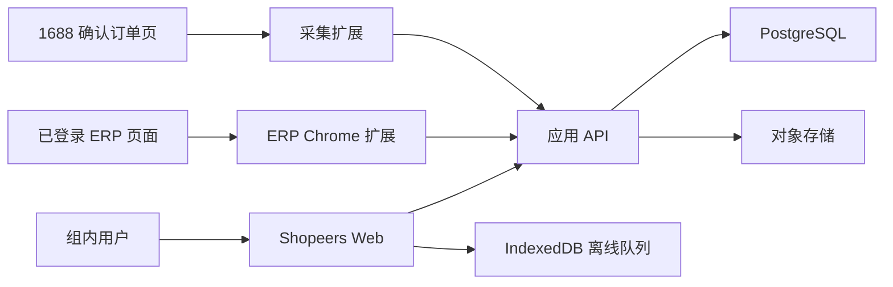

# Shopeers 云端协作架构

状态：目标架构；本机 outbox 与开发同步合同已实现，尚未创建外部资源

## 1. 推荐方案

- 前端：现有 React + Vite 单页应用。
- 应用 API：TypeScript 服务层；早期可由 Supabase Edge Functions 或独立 Node 服务承载。
- 主数据库：托管 PostgreSQL，推荐 Supabase Postgres。
- 身份与权限：Supabase Auth 或公司统一身份源。
- 文件存储：对象存储保存原始台账、导出文件和商品图片缓存。
- 前端托管：Vercel 或 Cloudflare Pages。
- 源码协作：GitHub 私有仓库，使用受保护的 `main` 分支和预览部署。

选择 PostgreSQL 的原因是平台 SKU 唯一约束、月度账本状态、成本来源追踪和审计关系都需要可靠事务与关系约束。Dexie 继续作为本地缓存和离线队列，而不是共享主数据库。

## 2. 运行拓扑



扩展只读取用户当前浏览器会话可访问的数据。ERP 和 1688 登录凭据、Cookie、Token 不上传数据库；上传的是经过校验的采集包、成本批次和来源摘要。

## 3. 数据分层

### 云端事实数据

- 工作区、成员和角色。
- 商品、平台 SKC/SKU、仓库 SKU 映射和供应商。
- 采集记录、ERP 成本请求/批次/事实。
- 销售导入批次、月度账本、成本决策、审批和利润明细。
- 审计日志和数据版本。

### 对象存储

- 原始 CSV/XLSX 文件。
- 导出的 Excel、备份包和审计附件。
- 经许可缓存的商品图片。

### 本地缓存

- 未提交表单和导入预览。
- 等待网络恢复的采集/成本上传队列。
- 最近访问数据和用户偏好。
- `auditEvents` 上的版本化同步 outbox：记录 `pending`、`in_flight`、`synced`、`failed` 状态和重试信息。

## 4. 权限模型

建议角色：

| 角色 | 主要权限 |
| --- | --- |
| 工作区管理员 | 成员、店铺、数据策略、解锁账本和全部导出 |
| 选品/采购 | 商品、供应商、采集确认、ERP 成本任务 |
| 运营 | 销售导入、筛选、账本草稿和成本请求 |
| 财务/复核 | 成本审批、利润复核、定稿和导出 |
| 只读 | 查看已授权数据和已定稿结果 |

所有业务表都包含 `workspace_id`。数据库启用行级权限，服务端再次校验角色；不能仅依赖前端隐藏按钮。

## 5. 一致性与审计

- 平台 SKU 唯一索引：`unique(workspace_id, canonical_platform_sku)`。
- 月度账本唯一索引：`unique(workspace_id, period, ledger_type)`，软删除记录另行处理。
- 成本批次只有完整成功后才能从 `completed` 发布为 `published`。
- 定稿在单个数据库事务内写入成本决策快照、利润结果和审计事件。
- 原始导入文件保存 SHA-256；解析结果保存解析器和字段映射版本。
- 金额使用数据库 `numeric`，不使用浮点字段。
- 本机 v7 以审计事件作为 outbox，使用全局 UUID `eventId` 和 `src/domain/syncEnvelope.js` 的 envelope v1；本机数值主键只负责 IndexedDB 排序，云端必须按 `workspace_id + event_id` 幂等处理并回写同步版本。
- 新设备恢复使用“完整云端种子基线 + 基线后的增量事件”，恢复前强制生成本机回滚备份。

## 6. 扩展同步

### ERP 扩展

1. 用户在 Shopeers 创建平台 SKC 成本请求。
2. 扩展读取请求或接收一次性任务码。
3. 用户在 ERP 页面执行实际查询。
4. 扩展在本地完成完整性校验和 v8.0 成本计算。
5. 用户检查结果后发布成本批次。
6. API 再次校验协议、幂等键、金额和映射后入库。

### 1688 采集扩展

保留 `CaptureEnvelope v1`。云端 API 使用短期会话令牌和扩展专用作用域替代本机固定密钥；内容脚本仍不能接触令牌。

## 7. 开发与发布流程

```text
本地功能分支
  -> 单元测试与构建
  -> GitHub Pull Request
  -> 自动检查
  -> 预览环境
  -> 数据库迁移审查
  -> 合并 main
  -> 预发布验证
  -> 生产发布
```

环境至少分为：

- `development`：开发者本地数据库或独立云项目。
- `staging`：脱敏样本和真实部署流程验证。
- `production`：正式组内数据。

数据库迁移进入源码并按顺序执行；禁止在生产控制台手工修改后不回写迁移文件。

## 8. 上云实施顺序

可执行的本地/预发布门禁和环境变量说明见 [`docs/DEPLOYMENT_GUIDE.md`](../DEPLOYMENT_GUIDE.md)。

1. 将当前工作区初始化为 Git 仓库并清理忽略规则。
2. 创建 GitHub 私有仓库并推送首个可构建基线。
3. 创建开发/预发布/生产数据库项目和环境变量模板。
4. 建立表结构、约束、行级权限、种子数据和迁移测试。
5. 用仓储接口替换页面中的 `demoData`，先迁移商品和月度账本主链路。
6. 建立 Vercel/Cloudflare 预览部署和主分支发布。
7. 接入扩展同步、对象存储、审计导出和备份恢复演练。

GitHub、数据库和托管平台的账号创建、授权、推送与部署都属于外部写操作，执行到该步骤时需要用户确认具体组织、仓库名、区域和权限。

## 9. 最低安全要求

- 密钥只放在部署平台的 Secret/Environment Variable 中，不提交仓库。
- 服务端校验文件类型、大小、工作区和幂等键。
- 原始台账和成本文件默认私有，下载使用短期签名地址。
- 审计日志不可由普通成员删除。
- 数据库每日备份，并定期执行可恢复性演练。
- 生产数据不得自动复制到开发环境；测试使用脱敏夹具。
