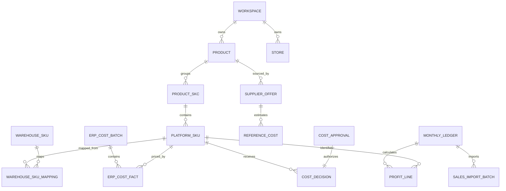

# Shopeers 领域模型

## 1. 总体关系

## 2. 标识模型

### Workspace

- `id`: 系统生成的稳定 ID。
- `name`: 工作区名称。
- `defaultCurrency`: 默认 `CNY`。
- `timezone`: 默认 `Asia/Shanghai`。

### AuditActor

- 云端实时审计的 `actorId` 必须是当前工作区 active member 的 `memberId`，并在服务端逐事件与 JWT `sub` 完全一致。
- ERP Assistant、浏览器桥接和自动收件属于技术来源，保存在 `receivedVia`/`source`，不能冒充业务操作者。
- 本地模式可使用 `local-user`；缺少真实云成员时不得创建携带 `local-user` 或技术来源身份的实时云端待同步事件。
- 恢复得到的 baseline/增量审计显式标记为已同步，不重新进入 outbox。旧 v12 技术 actor 由 v13 前向迁移修复；v14 为已经运行旧 v13 的数据库补正同步成功短路与不确定投递状态，但不改写任何既有合同终态。精确的 v12 reset 签名允许识别曾被写成 stale member 的迁移行，但普通成员业务事件不参与。本地模式归入 `local-user` baseline；云端在认证成员未知时先终态隔离，领取前再用当前会话成员幂等修正。自动修复不覆盖后续合同终态，只有人工 retry 可重新开放；已同步身份与内容哈希不可改写。

### Product

商品资料容器，不直接承担成本唯一性。保存名称、图片、标签、状态和来源追踪。

### ProductSkc

- `platformSkc`: 用户可见的业务代码。
- 同一工作区内允许一个 SKC 包含多个平台 SKU。
- 是 ERP 成本请求和利润筛选/复制的单位。

### PlatformSku

- `platformSku`: 用户可见业务代码。
- `canonicalSku`: `NFKC -> trim -> uppercase` 后的比较键。
- 唯一约束：`workspaceId + canonicalSku`。
- 是成本匹配、利润计算和跨模块反馈的全局业务标识。
- 代码的原始显示值保留，不用规范化值覆盖用户输入。

### WarehouseSku

- ERP 采购明细中的库存/仓库标识。
- 通过 `WarehouseSkuMapping` 映射平台 SKC 与平台 SKU。
- 一个仓库 SKU 可以映射多个平台 SKU，也可以跨多个平台 SKC；引流货品和共用库存会共享同一份采购历史证据。
- `warehouseEvidence` 以仓库 SKU 为证据身份，只保存一次采购历史；各平台映射行通过 `evidenceRef` 引用，不能复制证据或把一个变体的账本范围提示传播给其他变体。
- 映射必须带有效期或采集批次，防止历史关系被静默覆盖。

## 3. 供应商与参考成本

### SupplierOffer

描述一个商品在 1688 等供应商的报价与来源：

- 来源平台、商品 ID、来源 URL、供应商名称。
- 采购单价、运费、操作费、采购份数、每份单品数。
- 来源 SKU、规格、图片和采集请求 ID。

### ReferenceCost

- `kind`: `supplier_landed`、`erp_history` 或 `finalized_profit_history`。
- `amount`、`currency`、`calculatedAt`、`inputSnapshot`。
- 仅用于选品参考，不自动成为正式成本。

## 4. ERP 成本模型

### ErpCostRequest

- `id`、`workspaceId`、`requestedBy`、`requestedAt`。
- `platformSkcs`: 规范化、去重后的非空 SKC 列表。
- `expectedSkus`: 当前账本实际需要核算的平台 SKU/SKC 快照，用于区分正式核对范围与同查询 SKC 下的额外变体。
- `ledgerId`: 可选，指向发起请求的月度账本。
- `status`: `draft`、`running`、`failed`、`completed`、`published`。

### ErpCostBatch

一次完整且一致的 ERP 计算结果。保存捕获的查询上下文摘要、ERP 数据范围、算法版本、输入/输出哈希、异常计数和创建人。

- v2 成本行使用 `ledgerScopeRole = expected | auxiliary`。服务端必须根据已登记请求独立重算，不能信任扩展声明。
- `expected` 行参与平台 SKU 精确匹配和正式发布；`auxiliary` 行只保留预览与审计，不参与平台/仓库兜底，也不降低已完整 expected 范围的证据状态。
- 无法获得精确 `expectedSkus` 请求快照时按 expected 且 fail-closed，不能把历史 partial 批次静默升级。

### ErpCostDelivery

- `resultDeliveryId`：ERP 扩展对一次核算结果生成的稳定投递标识；即时重试和缓存补发必须复用。
- 同一 `resultDeliveryId` 只能对应同一份请求范围和输入摘要；相同标识携带不同输入属于冲突，不能当作幂等成功。
- 缺少明确 `requestId + ledgerId` 时，只能按工作区、核算时间快照和完整 canonical SKC 集合唯一恢复请求；多个候选必须返回 `ERP_REQUEST_AMBIGUOUS`。
- 自动载入必须同时匹配 `ledgerId`、`requestId` 和规范化后的完整平台 SKC 集合。
- 当前利润页面的筛选 SKC 集合还必须与请求范围一致才可自动载入；范围不同的批次继续可见，但只能人工选择预览。
- 未映射平台 SKU、映射失败和仅含排除记录的仓库 SKU 仍需保留原始行、排除记录与来源警告；这类证据可预览但不得直接发布正式成本。
- 本地收件状态依次为 `pending`、`loaded`、`applied`、`rejected` 或 `voided`；`rejected` 表示用户删除未发布收件批次，仍保留原始 envelope 和审计；`voided` 表示关联的正式成本发布已作废。终态批次不能重新进入待处理，`loaded` 可在未发布前恢复预览。
- `pending`/`loaded` 只允许进入 `rejected`，不能物理删除证据；`applied` 只允许通过带原因的正式作废流程进入 `voided`。
- 手工导入的完整 v2 envelope 在发布时必须创建 `receivedVia=manual-v2-import` 的 `applied` 收件记录；所有 `published` 正式批次都必须能从收件历史进入同一作废流程。
- 云端必须同时持久化 ERP 正式批次与 `erp_cost_inbox`：`published` 批次对应唯一 `applied` inbox，`voided` 批次对应同一条 `voided` inbox，并保留 `envelope`、`appliedBatchId`、`voidedBatchId` 和作废元数据。旧恢复载荷若存在正式批次却缺少 inbox，必须明确拒绝，不能伪造完整证据。
- 云端作废是一次性的受控状态转换：数据库先锁定并核对远端真实 `published` batch、唯一 `applied` inbox 和账本状态，再在同一事务中写入一致的 `voidedAt`、`voidedBy`、`voidReason`。batch/inbox 的身份、envelope、发布关联和时间戳证据不可由通用 update 改写；重复作废、零行更新、缺少元数据或一批多 inbox 均按冲突拒绝。云端作废统一要求 finance/admin；远端账本实际为 finalized 时，同一同步事务还必须包含 finance-only 的受控重开事件，不能信任客户端声明的旧账本状态。
- finalized 账本的 `voided` 与 `reopened_for_cost_recalculation` 审计事件共享稳定 `transitionId`，并严格匹配账本、正式批次、操作者、原因和时间。outbox 将相邻配对视为一个原子领取单元，即使跨越普通 `limit` 边界也不能拆包；每个同步包仍不得超过 500 条，边界容量不足时整个二事件组顺延到下一包，`limit=1` 只可为完整配对扩展到 2 条。云端仅允许去重后仍属于本事务待执行的完整配对授权重开，历史已同步事件不得参与新作废授权。
- 同步 envelope 继续使用 v1。旧版已生成且缺少 `transitionId/voidedBatchId` 的作废与重开事件不原地改写：远端已存在且内容摘要一致时直接幂等确认；仍在本地 pending/failed 时，只有相邻且账本、批次、操作者、原因、时间和双侧作废元数据全部一致的无歧义配对，才可在运行时推导 identity 并同步。推导值不写回原事件，也不改变原事件内容哈希；部分携带新 identity、字段不一致或无法配对的旧事件进入终态失败，等待人工修复后显式重试。
- 恢复包复用同一配对合同：新格式缺失 identity 或任一账本、批次、操作者、原因、时间不一致即拒绝；旧格式只接受上述无歧义相邻配对，不能在恢复时宽松升级。
- 同步失败按事件精确隔离：结构化不可重试错误只终止 `eventIds` 点名的本批事件，其余已领取事件回到 `pending`；没有事件范围的整包合同错误才终止整包。显式 `retryable: true` 优先，408/429/5xx 默认重试，400/409 默认终态，身份/权限错误释放等待恢复。

### ErpCostFact

- 平台 SKU、仓库 SKU、平台 SKC。
- 单件成本和 `CNY` 币种。
- 单号、单号类型、入选采购记录 ID。
- 总采购量、总采购价、日期范围和计算时间。
- 映射是否为仓库 SKU 兜底。

成本事实不可原地改写；新抓取产生新批次和新事实。

正式 ERP 成本批次使用 `published | voided` 状态。作废批次保留全部成本行和来源证据；读取当前成本时，以每个平台 SKU 时间上最新的发布事实为准，并且父批次必须明确为 `published`。父批次缺失、状态未知或任何非 `published` 状态都按缺少正式成本处理，不能回退到更早批次。后续新的合格发布可以重新建立正式成本。存在 `published/applied/voided` 生命周期记录的账本不能物理删除，日常纠错必须保留证据并使用作废流程。

云端重开已定稿账本只能由 `reopened_for_cost_recalculation` 同步事件调用受控数据库函数，在同一事务中清除当前活动利润行、写回重开账本并追加审计。普通利润行删除继续受不可变触发器阻止；`locked` 账本不能使用该路径。

## 5. 正式成本决策

### CostDecision

对某个账本、平台 SKU 决定本次利润计算使用什么成本：

- `source`: `erp` 或 `approved_1688`。
- `amount`、`currency`。
- `erpCostFactId` 或 `costApprovalId`。
- `status`: `missing`、`reference_only`、`pending_approval`、`final`。
- `decidedAt`、`decidedBy`、`policyVersion`。

规则：

1. 存在有效 ERP 成本时必须选择 ERP。
2. ERP 缺失且只有 1688 参考成本时，状态仍为 `reference_only`。
3. ERP 缺失且审批完整时，才能生成 `approved_1688` 正式决策。
4. ERP 后补不会静默改写已锁定账本。

### CostApproval

- `referenceCostId`、`approvedAmount`、`currency`。
- `reason`、`approvedBy`、`approvedAt`。
- `status`: `approved`、`revoked`。
- 审批仅对指定工作区、账本和平台 SKU 有效，不能全局复用。

## 6. 月度利润模型

### MonthlyLedger

- 唯一键：`workspaceId + period(YYYY-MM) + type`。
- `status`: `draft`、`cost_pending`、`approval_pending`、`ready`、`finalized`、`locked`。
- 保存仓储费率、公式版本、定稿时间和锁定人。

### SalesImportBatch

- 文件名、文件 SHA-256、默认店铺、字段映射、来源行数、有效行数和忽略行数。
- 每行保留来源批次和来源行号。
- 重复导入替换按兼容一级分组键执行。

### ProfitLine

- 店铺、供方货号、平台 SKC、平台 SKU、属性。
- 销量、销售金额、扣款、来源行数和真实订单数。
- 正式单件成本、采购成本、仓储成本、利润和利润率。
- `costDecisionId`、`calculationMode=exact`、`formulaVersion`。

选品页面上的估算行使用独立的 `SelectionProfitReference`，其 `calculationMode=reference`，不能写入月度正式结果。

## 7. 审计与版本

以下对象只追加新版本或使用显式状态变更，不允许无痕覆盖：

- ERP 成本批次和成本事实。
- 成本审批与撤销。
- 月度账本定稿、解锁和重新计算。
- 销售导入批次与替换范围。
- 平台 SKU 合并、停用或重新归属。

每个审计事件至少包含：工作区、操作者、时间、动作、对象类型、对象 ID、前后摘要和关联批次。

`0.2.6-beta.1` 从本地数据库 v11 升级到 v12 时执行一次测试成本数据重置：清除 ERP 请求、收件、正式成本、账本级成本审批与当前利润结果，保留销售导入、商品档案、供应商、1688 参考和目录人工成本；有销售明细的账本回到 `cost_pending`，空账本回到 `draft`。该迁移是唯一允许重置 `locked` 测试账本的例外，日常 repository 流程仍拒绝修改锁定账本。
